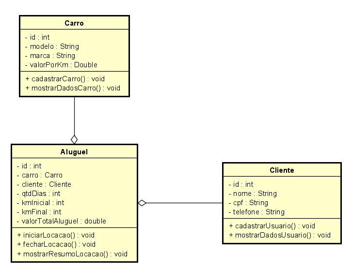

## Sistema de Gerenciamento de Locação de Veículos

Bem-vindo ao projeto de Sistema de Gerenciamento de Locação de Veículos! Este projeto foi desenvolvido como parte de uma atividade com o objetivo de criar um sistema eficiente para gerenciar o processo de locação de veículos. Ele se baseia no seguinte diagrama de classes:

Além do diagrama de classes, necessitou-se cumprir alguns requisitos que descreve as seguintes regras para o sistema:

- O método de cadastro de usuário deve coletar as informações por meio de um diálogo JOptionPane.
- O método de exibição de dados do usuário deve preparar uma string formatada, que será retornada como saída do método.
- Os mesmos comportamentos presentes nos métodos de usuário devem ser implementados também para a entidade "Carro".
- O método de início de aluguel deve invocar os métodos de cadastro de usuário e de cadastro de carro no objeto relacionado com a locação.
- O método de início de aluguel também deve coletar o valor do quilômetro inicial do veículo.
- O método de fechamento de locação deve coletar a informação do quilômetro final do veículo.
    - Para calcular o valor da locação, deve-se multiplicar a quantidade de dias de locação pelo valor por quilômetro. Além disso, caso o carro tenha sido alugado por mais de 10 dias, um desconto de 10% deve ser aplicado; se a locação exceder 20 dias, um desconto de 20% será aplicado. O valor final calculado deve ser armazenado no atributo "valorTotalAluguel".
- O método de exibição do resumo da locação deve apresentar as informações do cliente, do carro e da locação em uma janela JOptionPane. O formato final deve ser o seguinte:

**Resumo da Locação**
**Cliente**
- Nome: Rogério
- CPF: 123.123.123-11
- Telefone: (11)1111-11111

**Carro**
- Modelo: HB20
- Marca: Hyundai
- Valor por Quilômetro: R$5.00

**Locação**
- Quantidade de Dias: 1
- Quilômetro Inicial: 100
- Quilômetro Final: 200
- Valor Total: R$500,00
